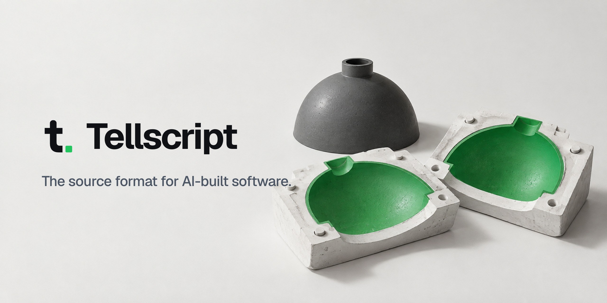

<p align="center">
  <a href="https://tellscript.com">
    <picture>
      <source media="(prefers-color-scheme: dark)" srcset=".github/assets/banner-dark.jpg">
      
    </picture>
  </a>
</p>

<p align="center">
  A Tellscript records what your software must do, how it looks and why, in Markdown next to your code.<br>
  Claude Code, Codex, Cursor or any other agent builds the code from it.
</p>

<p align="center">
  <a href="https://tellscript.com/docs/quickstart">Quickstart</a> ·
  <a href="https://tellscript.com/docs">Docs</a> ·
  <a href="spec/draft.md">Spec</a> ·
  <a href="examples/castwell">Example</a> ·
  <a href="https://github.com/tellscript-dev/tellscript/discussions">Discussions</a>
</p>

<p align="center">
  <a href="https://github.com/tellscript-dev/tellscript/actions/workflows/ci.yml"></a>
  <a href="spec/draft.md"></a>
  <a href="LICENSE.md"></a>
</p>

## What it looks like

A Tellscript is a folder `tell/` next to your code, one Markdown file per feature. Each statement has an id that never
changes, one sentence a test can prove wrong, and a line to that test.

```markdown
---
tell: feature/cart
checks: [checks/cart.spec.ts]
face: [reference/cart.png]
rationale: [decision/one-voucher]
---
# Cart

## Behaviour · fixed
C1 When the goods reach €50.00,
   shipping is free.
   → cart.spec#free-shipping
C2 When a second voucher arrives,
   it is declined with a notice.
   → cart.spec#one-voucher

## Free
Speed, internal names, accessibility.
```

The ring after each heading tells the next model how much it may change: **fixed** is rebuilt exactly, **guided**
may be improved with a recorded decision, **free** may be improved without asking. The checks decide.

## Teach your agent

Install the skill, and your agent reads, writes and respects Tellscripts on its own.

```sh
npx skills add tellscript-dev/tellscript
```

The installer puts the skill where your agent looks for it: Claude Code, Codex, Cursor, Gemini CLI, GitHub Copilot,
OpenCode and more. In Claude Code you can also add it as a plugin:

```text
/plugin marketplace add tellscript-dev/tellscript
/plugin install tellscript@tellscript
```

No installer at hand? Paste this into any coding agent:

```text
Learn the Tellscript format from https://tellscript.com/llms-full.txt
Then add a short "Tellscript" section to the instruction file you read here
(AGENTS.md, CLAUDE.md, GEMINI.md, .cursor/rules or .github/copilot-instructions.md):

- tell/ is the source of truth for what this app must do and look like.
  Read the matching file before changing behaviour.
- Never break a fixed statement. Propose changes to guided sections;
  improve free sections freely.
- New or changed behaviour updates tell/ in the same change:
  a stable id and a check per statement.
```

Which file each agent reads is listed in [Teach your agent](docs/agents.md).

## How it works

1. **Write it down.** One file per feature: intent, numbered statements, the look as a reference image, the reasons
   as decisions. Your agent writes the first draft; [the quickstart](docs/quickstart.md) has the prompt.
2. **Bind it.** Every statement points to the test, reference image or recipe that proves it.
3. **Build and rebuild.** Any agent builds an edition from the Tellscript. When a better model arrives, it builds the
   next one in an empty folder, and the checks decide whether it replaces the running one.

## In this repository

| Folder | What it holds |
|---|---|
| [`spec/`](spec/draft.md) | The format, in normative language. Draft 0.1. |
| [`schema/`](schema/front-matter.schema.json) | JSON Schema for the front matter of every `.tell.md` file |
| [`docs/`](docs/README.md) | The documentation, the same pages as on [tellscript.com/docs](https://tellscript.com/docs) |
| [`examples/castwell/`](examples/castwell) | A complete Tellscript for a small shop: four files and a check |
| [`skills/tellscript/`](skills/tellscript/SKILL.md) | The agent skill, in the open Agent Skills format |
| [`scripts/check.mjs`](scripts/check.mjs) | Checks `.tell.md` files against the format: `node scripts/check.mjs <folder>` |

## Status

Tellscript is a draft and may still change before 1.0. It is maintained by [Riverlabs](https://riverlabs.de) in
Berlin. Proposals are welcome as a [spec change](https://github.com/tellscript-dev/tellscript/issues/new/choose)
or in [Discussions](https://github.com/tellscript-dev/tellscript/discussions).

## Contributing

Read [CONTRIBUTING.md](https://github.com/tellscript-dev/.github/blob/main/CONTRIBUTING.md). Pull request titles follow
[Conventional Commits](https://www.conventionalcommits.org/), for example `docs: explain guided rings`, because they
become the commit message and the changelog entry.

## License

The spec and docs are licensed under [CC BY 4.0](LICENSES/CC-BY-4.0.txt), the schema, scripts and skill under
[Apache 2.0](LICENSES/Apache-2.0.txt), and the examples are dedicated to the public domain under
[CC0 1.0](LICENSES/CC0-1.0.txt). Details in [LICENSE.md](LICENSE.md).
